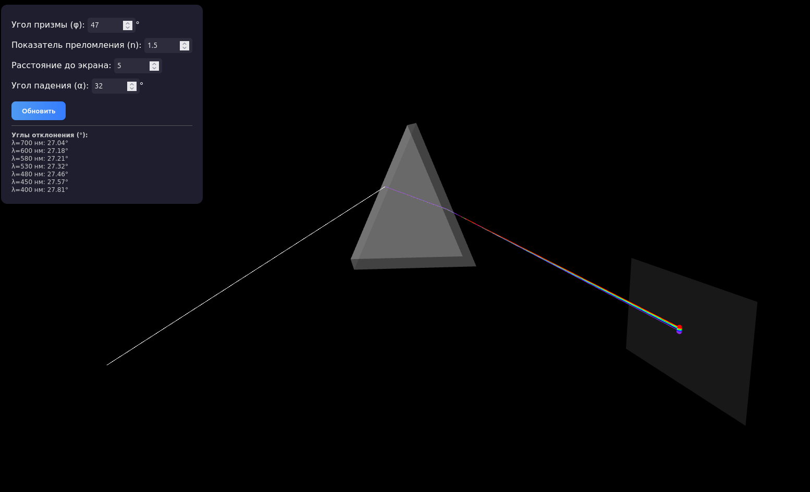
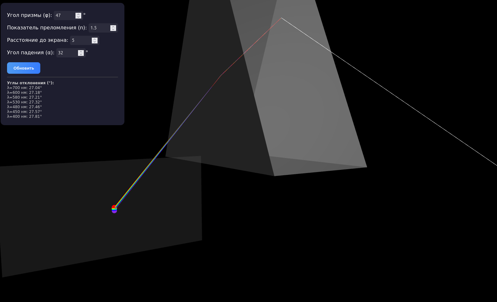
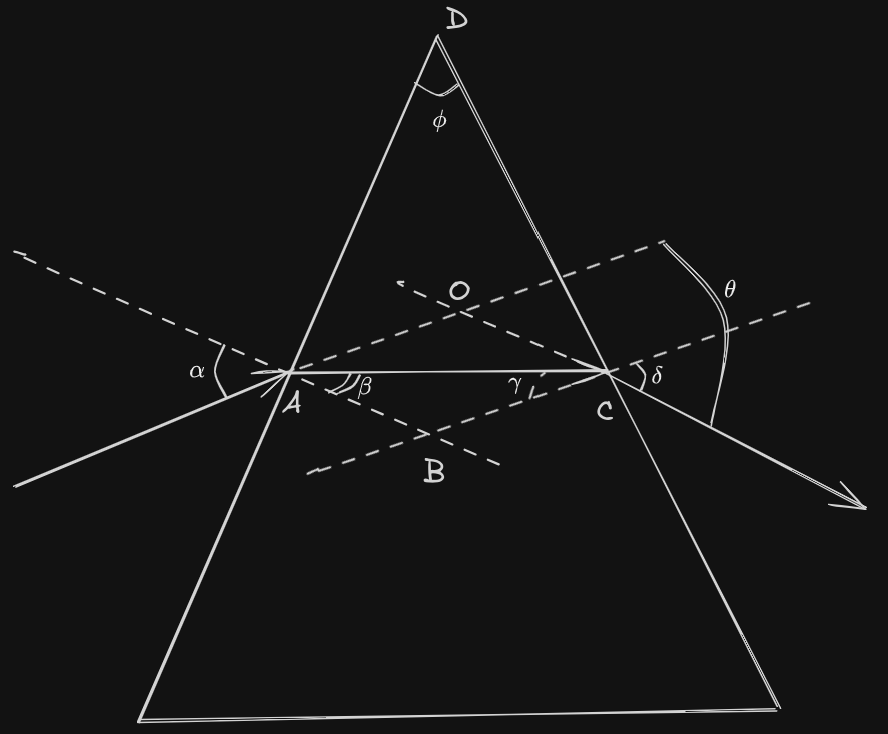

# Дисперсия света в призме

## Задача
Моделирование преломления света в призме и визуализация спектра.

## Функциональность
- Задание угла призмы
- Задание показателя преломления в зависимости от длины волны
- Расчет углов отклонения для разных длин волн
- Визуализация хода лучей в 3D
- Построение выходящего спектра на экране
- Отображение спектра в виде цветной полосы (дополнительное задание)

## Скриншоты


## Теоретическое обоснование

### Преломление в призме
Луч света падает на первую грань призмы под углом α. Угол при вершине призмы - φ



Рассмотрим $\Delta AOC$:

Угол $\phi$ смежный с углом $AOC$ => $\phi = \angle AOC - \angle OCA = (\alpha - \beta) + (\delta - \gamma)$

$\phi = (\alpha + \delta) - (\beta + \gamma)$

Четырехугольник ABCD:

$\angle BAD = \angle BCD = 90^o$

$\angle ABC = 360^o - 90^o - 90^o-\phi = 180^o - \phi$

$\Delta ABC:$

$\beta + \gamma + 180^o - \phi = 180^o$

$\phi = \beta + \gamma$

$\theta = (\alpha + \delta) - (\beta + \gamma) = (\alpha + \delta) - \phi$

Закон преломления для выходящего из призмы луча:

$\frac{sin \gamma}{sin \delta} = \frac{1}{n}$ => $sin \delta = n sin \gamma$

$\delta = arcsin(n sin \gamma)$

$\phi = \beta + \gamma$ => $\gamma = \phi - \beta$

$\delta = arcsin(n sin (\phi - \beta))$

Закон преломления для падающего на призму луча:

$\frac{sin \alpha}{sin \beta} = n$ => $sin \beta = \frac{sin \alpha}{n}$

$\beta = arcsin(\frac{sin \alpha}{n})$

$\delta = arcsin(n sin (\phi - arcsin(\frac{sin \alpha}{n})))$

$\theta = \alpha + \delta - \phi$

$\theta = \alpha - \phi + arcsin(n sin (\phi - arcsin(\frac{sin \alpha}{n})))$

### Геометрические параметры призмы
Вершины призмы в системе координат:


где , 
 — ширина основания.

### Проекция на экран
Координаты точки пересечения с экраном:


где $d$ — расстояние до экрана.

Программа использует набор из 7 характерных длин волн видимого диапазона, соответствующих основным цветам спектра:

```js
const spectrumColors = [
    { color: 0xff0000, lambda: 700 }, // Красный (700 нм)
    { color: 0xffa500, lambda: 600 }, // Оранжевый (600 нм)
    { color: 0xffff00, lambda: 580 }, // Жёлтый (580 нм)
    { color: 0x00ff00, lambda: 530 }, // Зелёный (530 нм)
    { color: 0x00ffff, lambda: 480 }, // Голубой (480 нм)
    { color: 0x0000ff, lambda: 450 }, // Синий (450 нм)
    { color: 0x8a2be2, lambda: 400 }  // Фиолетовый (400 нм)
];
```

### Расчёт показателя преломления
Для каждой длины волны рассчитывается свой показатель преломления по формуле:

`const n_lambda = n + 3000 / (lambda * lambda);`

Где:
n - базовый показатель преломления (заданный пользователем),
lambda - длина волны в нанометрах,
3000 - эмпирическая дисперсионная постоянная
